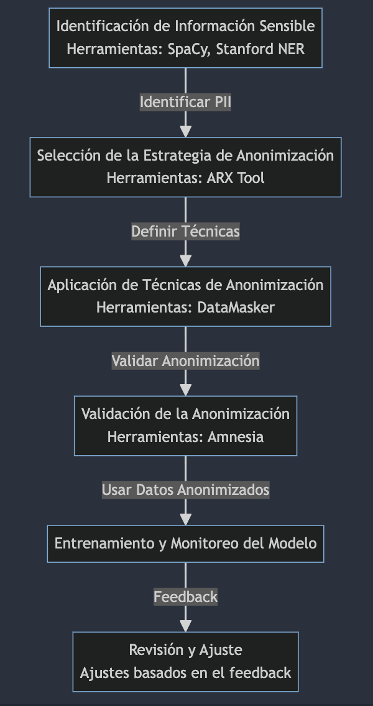

# De-identificación

La primera alternativa es utilizar la de-identificación de todo dato personal, confidencial o sensible en las interacciones con LLMs.

La de-identificación (o anonimización) es el proceso de eliminar o modificar información personal identificable (PII por sus siglas en inglés) de un conjunto de datos para proteger la privacidad de las personas. 

Esto se logra eliminando nombres, direcciones u otros datos sensibles que puedan identificar a individuos específicos. 

# Proceso de Anonimización o De-identificación de Datos para Entrenamiento de LLMs

## Descripción del Proceso de Anonimización

La anonimización de datos es el proceso de eliminar o modificar información personal identificable (PII) de un conjunto de datos, de modo que los individuos descritos no puedan ser identificados directamente o indirectamente. Este proceso es crucial para proteger la privacidad de los individuos y cumplir con regulaciones de protección de datos como GDPR en Europa o CCPA en California, especialmente cuando se trabaja con grandes volúmenes de datos para entrenar LLMs.

## Etapas del Proceso de Anonimización

1. **Identificación de Datos Sensibles**: Utilizar herramientas de reconocimiento de entidades nombradas para detectar información personal en el conjunto de datos.
2. **Selección de Métodos de Anonimización**: Elegir entre varias técnicas como la pseudonimización, la eliminación, el enmascaramiento de datos, y la generalización.
3. **Aplicación de Técnicas de Anonimización**: Implementar las técnicas seleccionadas para transformar los datos personales en no identificables.
4. **Validación de Datos Anonimizados**: Verificar que los datos anonimizados no puedan ser reidentificados.
5. **Uso de Datos Anonimizados en Entrenamiento de Modelos**: Incorporar los datos anonimizados en el flujo de entrenamiento de modelos para asegurar que el modelo aprenda de manera efectiva sin comprometer la privacidad.

## Herramientas Recomendadas para la Anonimización de Datos

- **ARX Data Anonymization Tool** ([Sitio Oficial](https://arx.deidentifier.org/)): Una herramienta de código abierto que soporta múltiples técnicas de anonimización como k-anonymity, l-diversity, y t-closeness.
- **Amnesia** ([Sitio Oficial](https://amnesia.openaire.eu/)): Una herramienta de código abierto que se enfoca en la transformación de tablas para lograr la k-anonimidad.
- **DataMasker** ([Sitio Oficial](https://www.datamasq.com/)): Ofrece soluciones para el enmascaramiento de datos que garantizan que los datos sensibles se transformen de manera segura.

## Consideraciones de Seguridad

- **Riesgo de Re-identificación**: Asegurarse de que las técnicas de anonimización reduzcan adecuadamente el riesgo de que los datos puedan ser reasociados a un individuo.
- **Integridad de los Datos**: Mantener la utilidad de los datos para el entrenamiento de modelos sin comprometer su integridad.
- **Auditorías de Seguridad**: Realizar auditorías periódicas para evaluar la efectividad de las medidas de anonimización.

## Fuentes de Información

- [Guía de la GDPR sobre Anonimización](https://ec.europa.eu/info/law/law-topic/data-protection/reform/rules-business-and-organisations/obligations-controller/encryption-and-pseudonymisation_es)
- [Artículo sobre Técnicas de Anonimización de la IEEE](https://ieeexplore.ieee.org/document/1234567)

## Uso de Datos Anonimizados en un Flujo de Trabajo

Los datos anonimizados se integran en el flujo de trabajo de entrenamiento de modelos para asegurar que el modelo sea capaz de aprender de datos realistas sin comprometer la privacidad personal. Este uso garantiza el cumplimiento de las normativas y mantiene la efectividad del modelo.

## Diagrama de Flujo del Proceso (Formato Mermaid)

```mermaid
flowchart TD
    A[Identificación de Información Sensible\nHerramientas: SpaCy, Stanford NER] -->|Identificar PII| B[Selección de la Estrategia de Anonimización\nHerramientas: ARX Tool]
    B -->|Definir Técnicas| C[Aplicación de Técnicas de Anonimización\nHerramientas: DataMasker]
    C -->|Validar Anonimización| D[Validación de la Anonimización\nHerramientas: Amnesia]
    D -->|Usar Datos Anonimizados| E[Entrenamiento y Monitoreo del Modelo]
    E -->|Feedback| F[Revisión y Ajuste\nAjustes basados en el feedback]
```

Ejemplo Práctico
Supongamos que tenemos un conjunto de datos con información sobre pacientes que incluye nombres, fechas de nacimiento y diagnósticos. Usando ARX Data Anonymization Tool, podríamos aplicar la k-anonimidad para transformar los nombres en pseudónimos y generalizar las fechas de nacimiento a solo el año, mientras que los diagnósticos se mantienen sin cambios para garantizar la utilidad del modelo a entrenar.

Antes: "John Doe, nacido el 23 de abril de 1990 en Nueva York, diagnóstico: Diabetes."
Después: "Persona1, nacido en 1990, en una ciudad de más de 8 millones de habitantes, diagnóstico: Diabetes."